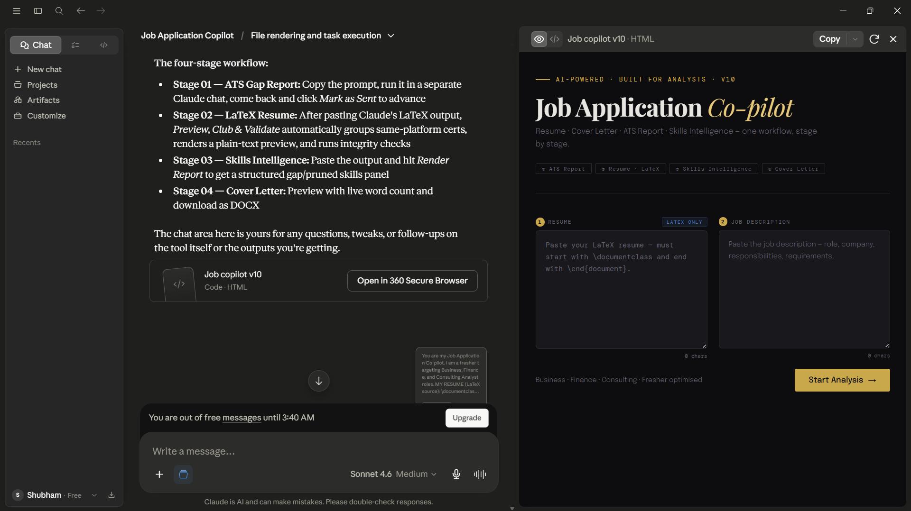

# Job Application Co-pilot

An AI-powered web app built inside Claude.ai targeting freshers applying to Business, Finance, and Consulting Analyst roles.

## What it does

Paste your LaTeX resume and a job description. The tool runs four gated stages:

1. **ATS Gap Report** — match score, missing keywords, overall fit summary
2. **Tailored LaTeX Resume** — restructured for the JD, with automatic certification grouping and 10+ integrity checks
3. **Skills Intelligence Report** — gap skills with free learning resources, pruned skills list
4. **Cover Letter** — structured, word-count-controlled, downloads as DOCX

Each stage requires user confirmation before proceeding. Inputs lock after starting to prevent mid-workflow changes.

## How it was built

No external IDE or codebase. Built entirely using a structured system prompt (~2,000 words) and a Claude.ai artifact.

Key design principles:
- Staged output logic with user-controlled gates
- Explicit writing constraints (banned vocabulary, banned structures) for consistent tone
- LaTeX parsing rules to preserve links, dates, and project integrity
- Cert clubbing logic: Claude outputs each certification individually; the artifact handles platform-based grouping automatically
- JSZip-based DOCX download that works inside the Claude iframe sandbox

## Certifications that informed the build

- **AI Fluency: Framework & Foundations** — Anthropic Academy. Applied the 4Ds framework: Delegation (deciding what to offload to AI), Description (structuring prompts with constraints and explicit output formats), Discernment (evaluating and validating outputs), Diligence (accounting for hallucination, context limits, non-determinism).
- **AI Concepts for Developers and Technology Professionals** — Microsoft Learn. Applied understanding of how LLMs process prompts, how generative AI agents work, and how NLP underpins structured text-in/text-out workflows.

## The broader point

Tools like this are commonly sold as subscription services. This project demonstrates that with the right foundational knowledge and a structured prompt engineering approach, the same functionality is buildable independently — by anyone willing to learn how these systems work.

## Usage

Open `job_copilot_v10.html` in a browser, or upload it as a Claude.ai artifact.

Paste your LaTeX resume and the job description, then follow the staged prompts using Claude.

## Tech

- Claude.ai (Artifact environment)
- HTML / CSS / JavaScript
- JSZip (via cdnjs)
- LaTeX (resume output, compiled in Overleaf)

## Contributing

This is an open source project. If you tailor it for a different 
role type, fix a bug, or improve the prompt logic — pull requests 
are welcome.

If you use it and find it useful, drop a star. It helps others find it.
